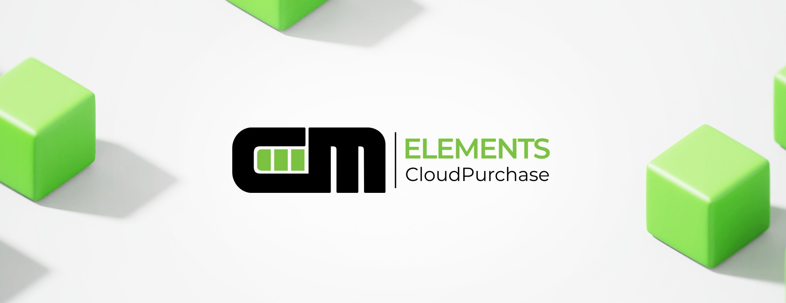
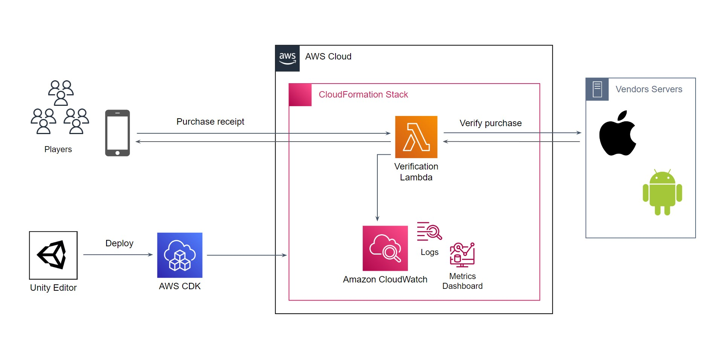

# What is CME CloudPurchase?

##  Overview

**CME CloudPurchase** is a **Unity** extension for server-side processing of in-game payments in your **AWS** cloud environment.

Its key difference from similar systems is complete control and significant cost savings thanks to a **cutting-edge** approach to cloud deployment in **AWS**. Sounds intriguing yet complicated? We have prepared step-by-step [guide](user_guide/getting_started.md) on creating and setting up a new account, and the process of deploying cloud infrastructure can be done from the Unity interface in just a couple of clicks.

As a result, you get a server solution deployed in your own cloud, enjoy unlimited opportunities for extended functionality, and don't need to get a yet-another-weird subscription.

**Sections**

- [CME CloudPurchase features](#features)
- [How CME CloudPurchase works](#how-it-works)
- [CME CloudPurchase pricing](#pricing)

##  CME CloudPurchase features

- [Verification of payments' correctness](#feature-1)
- [Test payment identification](#feature-2)
- [Tracking payment history](#feature-3)
- [Managing deployment environments](#feature-4)
- [Extension and modification](#feature-5)

###  Verification of payments' correctness

**CME CloudPurchase** performs verification using special APIs for each of the supported platforms to more reliably confirm the correctness of in-game purchases.

**CME CloudPurchase** currently supports the **Google Play Store** and **Apple App Store**.

See the [Getting Started / Configuring Stores Integrations](user_guide/getting_started.md#stores) section in the User Guide for more information on platform integration.

###  Test payment identification

**CME CloudPurchase** helps to separate test payments and, if possible, repeat purchases for informed decision-making.

See the [Making Validation Requests](user_guide/making_validation_requests.md) section in the Developer Guide for more details on payment verification and operation mechanics.

###  Tracking payment history

Thanks to a unique system of logging and metrics in **Amazon CloudWatch**, **CME CloudPurchase** allows you to monitor payments in real time and upload the entire payment history for further analysis.

See the [Usage Statistics and Monitoring](user_guide/usage_statistics.md) section in the User Guide for more information on cloud application usage statistics and monitoring.

###  Managing deployment environments

**CME CloudPurchase** allows you to switch between the test and main operating environments directly from the **Unity Editor** to easily check your cloud application's configuration.

See the [Managing Cloud Environments](user_guide/managing_cloud_environments.md) section of the Developer Guide for more information on cloud deployment.

###  Extension and modification

Almost all of the logic in Assets/CME is extensively documented and available for adaptation for seamless integration with your application's logic. 

The cloud logic is arranged in'Cloud/Cloud.sln', a special solution in the projects.

- 'CME.CloudPurchase/CME.CloudPurchase.csproj' containing the runtime logic of the server application.
- 'CME.CloudDefinition/CME.CloudDefinition.csproj' containing the logic for deploying a cloud infrastructure.

##  How CME CloudPurchase works

The extension consists of two elements: 

1. Ready-to-use C# code for client and server payment processing;
2. Cloud application deployment tools built into **Unity Editor**.

Each payment in the purchase scenario is processed by sending a request to the **cloud application** deployed in the chosen **environment**.

The request is made using the [client library](api_reference/namespaces.md) integrated into the game. 

The environment is selected in the special **Unity Editor** extension window before building or running the application.

### Cloud application

A cloud application is a set of related **AWS** components required for checking, storing, and monitoring payment history.

### Deployment environment

The application is divided into named environments to enable secure testing of cloud application configurations and extensions.

##  CME CloudPurchase pricing

**CME CloudPurchase** uses **AWS** resources very efficiently and is [fully compliant](https://calculator.aws/#/estimate?id=173c99261f287852c34cb50214c1fe6c34f4e14b) with the **AWS Free Tier** terms of use.

That is why the [trial version](https://assetstore.unity.com/preview/224130/709634) of **CME CloudPurchase** will be completely free for you.

Should it be impossible to use **AWS Free Tier**, the operating cost [is still highly competitive](https://calculator.aws/#/estimate?id=4146e963f41967449d736e1a9b1d80cadda074a1).
