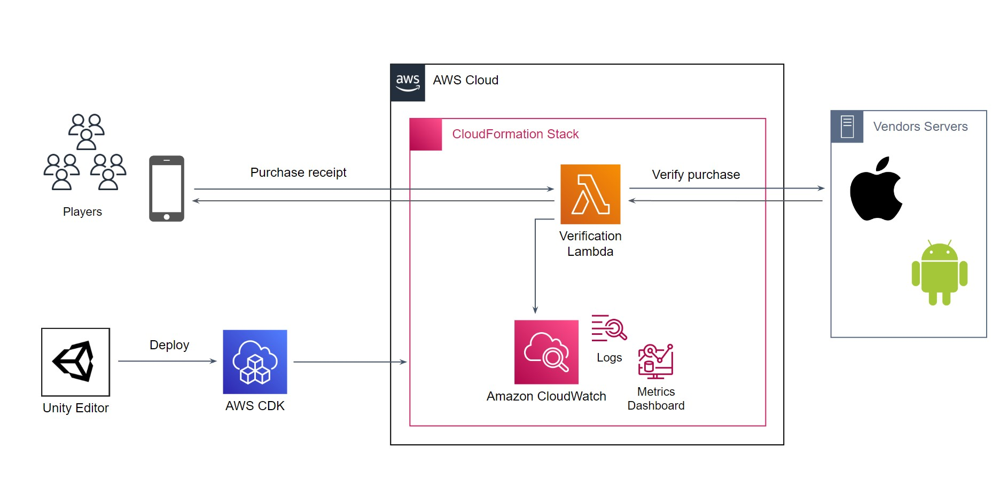

# What is CME CloudPurchase?

## Overview

CME CloudPurchase это расширение Unity для серверной обработки внутриигровых платежей в вашей собственной облачной среде AWS.

Расширение состоит из двух частей:

1. Готовый к использованию C# код клиентской и серверной обработки платежей;
2. Инструменты развертывания облачного приложения встроенные в Unity Editor.

**Topics**

- [CME CloudPurchase features](#features)
- [How CME CloudPurchase works](#how-it-works)
- [CME CloudPurchase costs](#costs)

##  CME CloudPurchase features

### Проверка корректности платежей

Для более надежного подтверждения корректности внутриигровых покупок CloudPurchase производит проверку используя специальные API для каждой из поддерживаемых платформ.

На данный момент подерживаются Google Play Store и Apple App Store.

Подробнее про интеграцию с платформами, смотрите раздел [Getting Started / Configure stores integrations](user_guide/getting_started.md#stores) в руководстве пользователя.

### Идентификация тестовых платежей

Для обоснованного принятия решений CloudPurchase помогает отделить тестовые платежи, и, при возможности, повторные покупки.

Подробнее о механике проверки платежей и работы, смотрите раздел [Making Validation Requests](user_guide/making_validation_requests.md) в руководстве разработчика.

### Отслеживание истории платежей

За счет специального формата логирования и метрик в Amazon CloudWatch, CloudPurchase позволяют наблюдать платежи в реальном времени, а так же выгрузить всю историю платежей для дальнейшего анализа.

Подробнее о статистике использоваания и наблюдении облачного приложения, смотрите раздел [Usage Statistics and Monitoring](user_guide/usage_statistics.md) в руководстве пользователя.

### Управление средами развертывания

Для удобства проверки конфигурации облачного приложения CloudPurchase порзволяет переключаться между тестовой и основной средой эксплуатации прямо из Unity Editor.

Подробнее о развертывании в облаке, смотрите раздел [Managing Cloud Environments](user_guide/managing_cloud_environments.md) в руководстве разработчика.

##  How CME CloudPurchase works

Обработка каждого платежа в рамках сценария совершения покупки происходит за счет вызова к **облачному приложению** развернутого в выбранной **среде**.

Вызов производиться с использованием [клиентской библиотеки](api_reference/namespaces.md) встраиваемой в игру.

Выбор среды производится в специальном окне расширения Unity Editor перед сборкой или запуском приложения.

### Облачное приложение

Облачное приложение это набор связанных компонетов AWS минимально необходимых для проверки, хранения и наблюдения истории платежей.

### Среда развертывания

Приложение разделено на именованные среды для возможности безопасного тестирования конфигураций и расширений облачного приложения.

##  CME CloudPurchase costs

CME CloudPurchase очень экономно использует ресурсы AWS и [попадает с большым запасом](https://calculator.aws/#/estimate?id=ae2647b051d15f2c996d1102bce3725352ce5267){target=_blank} в ограничения AWS Free Tier.

Поэтому при использовании [триальной версии](Unity Asset Store){target=_blank} CME CloudPurchase будет для вас полностью бесплатен.

При невозможности использовать AWS Free Tier стоимсть эксплуалтации [остается крайне эффективной](https://calculator.aws/#/estimate?id=ae2647b051d15f2c996d1102bce3725352ce5267){target=_blank}. 
