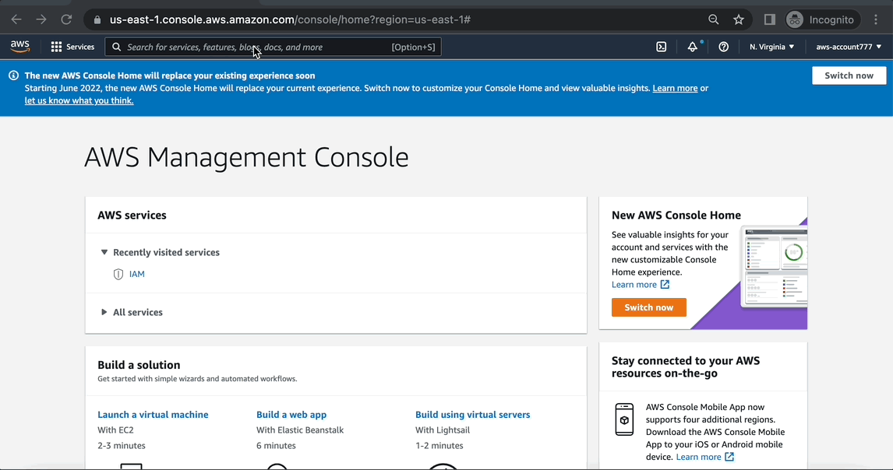
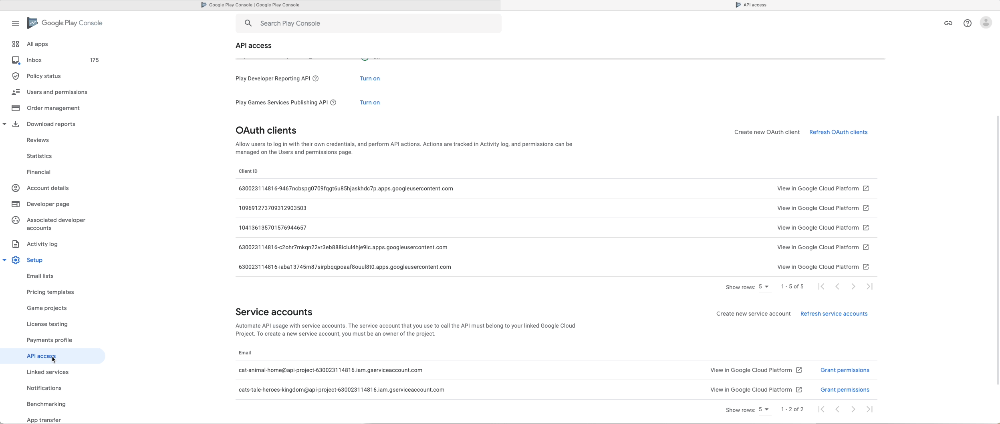
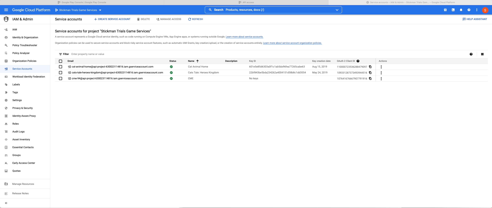
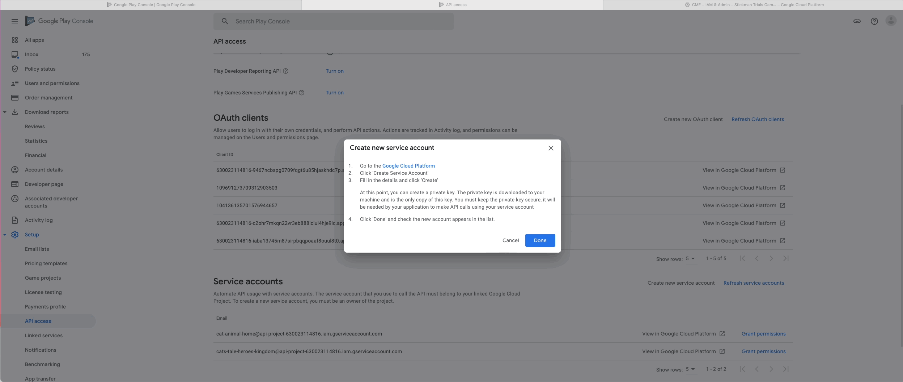

# Getting Started with CME CloudPurchase

Установка CME CloudPurchase довольно проста и состоит из следующих шагов:

1. Установить [Unity плагин](#install).
2. Получить [AWS Credentials](#aws-credentials).
3. Выполнить [первый деплой](#deployment).
4. Сконфигурировать [ключи доступа](#stores) к Google Developer Console.

##  Install the Unity plugin

Актуальная версия CME CloudPurchase находится в [Unity Asset Store](https://assetstore.unity.com/preview/224332/710152), при желании можно воспользоваться [пробной версией](https://assetstore.unity.com/preview/224130/709634).

Хороший мануал по установки unity плагинов есть на [сайте](https://docs.unity3d.com/Manual/AssetPackagesPurchase.html){target=_blank} официальной документации Unity.

##  Get your AWS security credentials

Если у вас еще нету аккаунта в AWS, то рекомендуем выполнить шаги [официального руководства](https://aws.amazon.com/premiumsupport/knowledge-center/create-and-activate-aws-account/){target=_blank}.

В случае, если аккаунт уже есть то можно переходить к получению ключей доступа.

### Generating security credentials

Для получения ключей доступа перейите в раздел [Identity and Access Management](https://console.aws.amazon.com/iamv2/home){target=_blank} и выполните следующие действия:

##  Make your first deployment

Warning

Без конфигурации <a href="#stores">ключей доступа</a> к Google Developer Console нет возможности проверять патежи в Google Play Store, поэтому проверка может выдавать ошибку:

Теперь вы готовы развернуть свое первое CME CloudPurchase приложения, для этого откройте Unity Editor преокт с установленным плагинов и выполните следующие действия:

##  Configure stores integrations

Для получения ключей доступа к Google Developer Console необходимо перейти в [Google Play Console](https://play.google.com/console/){target=_blank} и выполните следующие действия:

1. Создайте сервисный аккаунт.

2. Создайте новый приватный ключ.

3. Выдайте необходимые разрешения для аккаунта.

Подробнее о процессе создания и настройки сервисного аккаунта можно узнать [здесь](https://developers.google.com/workspace/guides/create-credentials#service-account){target=_blank}.
