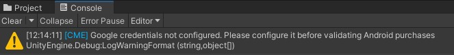
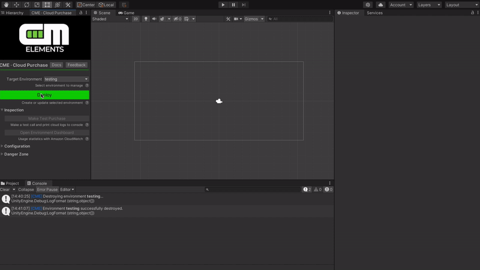
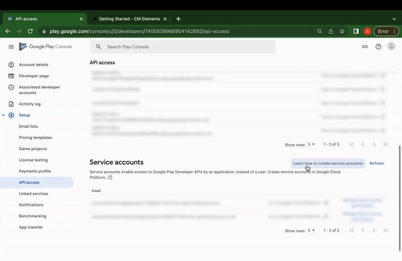
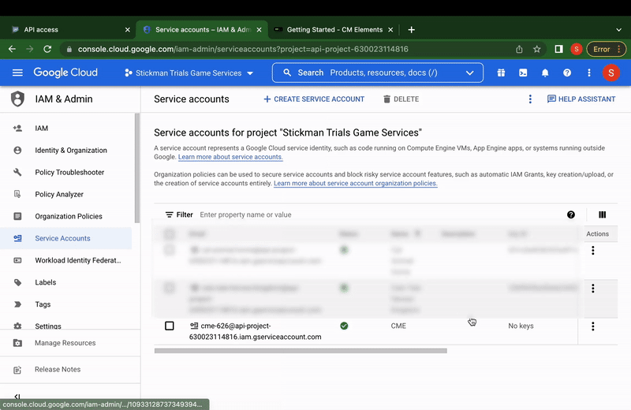
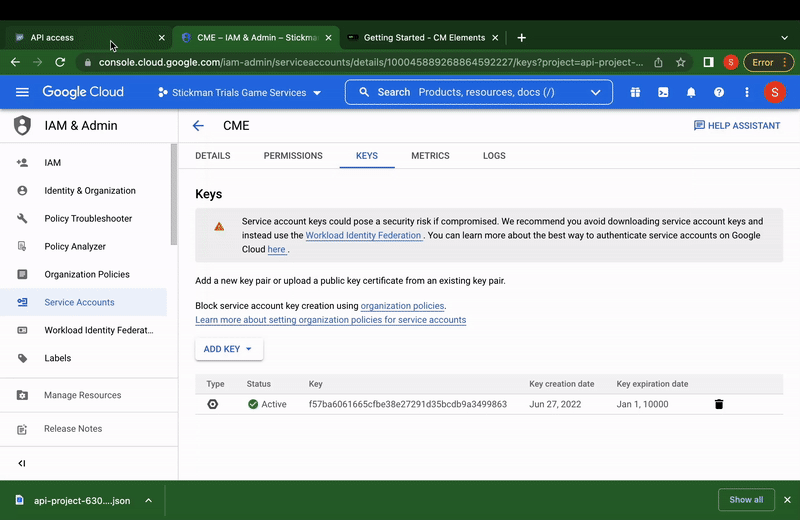

# Getting Started with CME CloudPurchase

Installing **CME CloudPurchase** is pretty simple and consists of the following steps:

1. Install the plug-in from the [Unity Asset Store](https://assetstore.unity.com/preview/224332/710152).
2. Get the [AWS Credentials](#aws-credentials).
3. Make the [first deployment](#deployment).
4. Configure [access keys](#stores) to the Google Developer Console.

##  Get your AWS security credentials

If you do not yet have an **AWS** account, we recommend following the instructions in the [official user guide](https://aws.amazon.com/premiumsupport/knowledge-center/create-and-activate-aws-account/).

If you already have an account, you can move on to getting the access keys.

### Generating security credentials

For access keys, go to [Identity and Access Management | Your Security Credentials](hhttps://us-east-1.console.aws.amazon.com/iam/home#/security_credentials) and get an access key by following the steps below:

##  Make your first deployment

Warning

Payments in the <b>Google Play Store</b> cannot be verified without the configuration of <b>Google Developer Console</b> <a href="#stores">access keys</a>. Therefore, the verification may display an error:

You are now ready to deploy your first **CME CloudPurchase** application. To do this, open the **Unity Editor** with the plug-in installed and click the **Deploy** button:

You will most likely have to install the generated AWS access keys into the opened '.aws/credentials' file in your home directory. See the [official userguide](https://docs.aws.amazon.com/cli/latest/userguide/cli-configure-files.html) for more details. 

##  Configuring stores integrations

For access keys to **Google Developer Console**, go to [Google Play Console](https://play.google.com/console/) and follow the steps below: 

1. Set up a service account.

2. Generate a new private key.

3. Set up the necessary permissions for the account.

See the [official userguide](https://developers.google.com/workspace/guides/create-credentials#service-account) for more information on the process of creating and setting up a service account.
