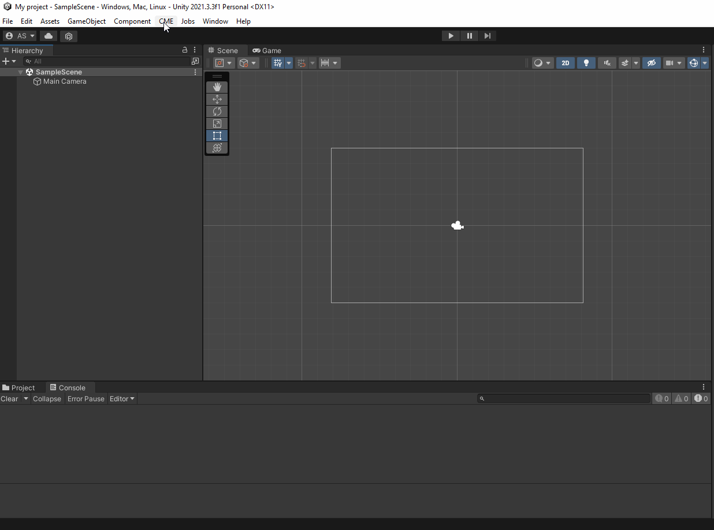
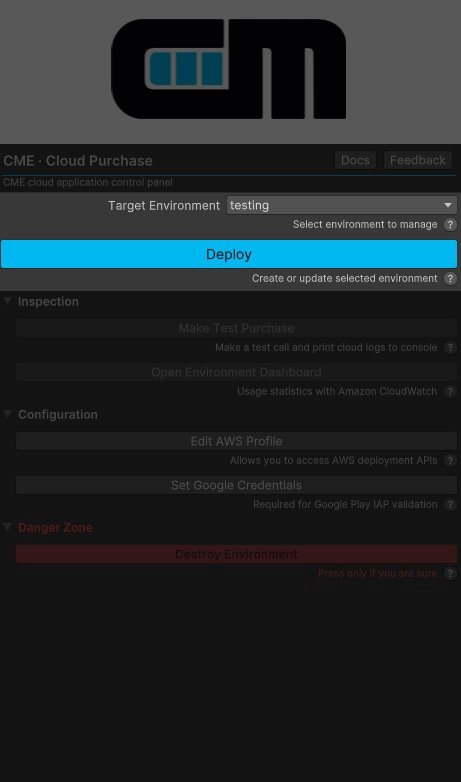
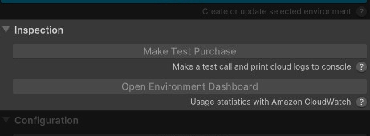
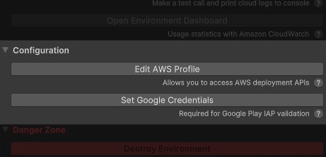
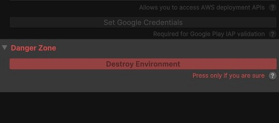

# Managing Cloud Environments

Управление **AWS** окружением и его деплоем, а также настройка плагина осуществляются прямо из **Unity** при помощи окна **Control Panel**.

Чтобы открыть **Control Panel** нажмите `CME -> Cloud Purchase -> Show Control Panel`. После этого откроется окно **Control Panel**.



## <a id="control-panel"></a> Control Panel Overview

{: style="height:547px;width:322px"}

### <a id="target-environment"></a> Target Environment

Параметр `Target Environment` определяет, каким окружением управлять. Доступно два окружения: `testing` и `production`. 

### <a id="deploy"></a> Deploy \ Update Deployment

Кнопка `Deploy \ Update Deployment` разворачивает выбранное окружение в AWS с текущими настройками или обновляет его, если оно уже было развернуто ранее.

## Inspection

{: style="height:547px;width:322px"}

### <a id="make-test-purchase"></a> Make Test Purchase

Кнопка `Make Test Purchase` позволяет сделать тестовый платеж в выбранном окружении. Логи платежа будут доступны в консоли. Также платеж можно будет увидеть на [дашборде](#environment-dashboard).

### <a id="environment-dashboard"></a> Environment Dashboard

Кнопка `Open Environment Dashboard` открывает в браузере дашборд в Amazon CloudWatch, на котором собрана информация о платежах на выбранном окружении.
Подробнее о возможностях дашборда [здесь](usage_statistics.md).

## Configuration

{: style="height:547px;width:322px"}

### <a id="edit-aws-profile"></a> Edit AWS Profile

Кнопка `Edit AWS Profile` открывает `credentials` файл, где описываются credentials для **AWS** сервисов. 
Пример того, как выглядят credentials описан ниже:
```
[cme-cloud-deploy]
aws_access_key_id     = AKIAXXXX1XXXXXX1XX1X
aws_secret_access_key = XtxJ11cL0r3211mKEKnmgWKVvjZFqtLOpZZiXxyz
region                = us-east-1
```

Подробнее о том, что такое **AWS Security Credentials** можно узнать в [официальной документции](https://docs.aws.amazon.com/cli/latest/userguide/cli-configure-files.html){target=_blank}, а то, как из получить прекрасно описано в разделе [Getting Started](getting_started.md).

### <a id="edit-google-credentials"></a> Set\Edit Google Credentials
Кнопка `Set\Edit Google Credentials` открывает `GoogleCredentials.json` файл, где описываются credentials для **Google API**. Подробнее о том, как создать сервисный аккаунт Google и получить credentials узнать в [официальной документации](https://developers.google.com/workspace/guides/create-credentials#service-account){target=_blank}.

## Danger Zone

{: style="height:547px;width:322px"}

### <a id="destroy-environment"></a> Destroy Environment
По нажатию кнопки `Destroy Environment` выбранное окружение будет удалено **вместе со всеми сопутствующими данными**.
