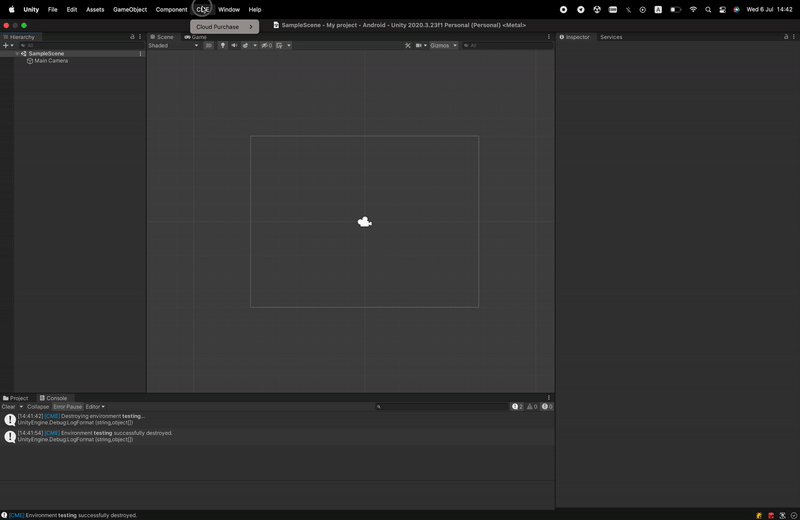

# Managing Cloud Environments

The **AWS** environment, its deployment, and the plug-in settings are managed directly from **Unity** using the **Control Panel** window. 

To open **Control Panel**, press 'CME -> Cloud Purchase -> Show Control Panel'. The **Control Panel** window will then open.



## <a id="control-panel"></a> Control Panel Overview

<figure markdown>

  <figcaption> </figcaption>
</figure>
### <a id="target-environment"></a> Target Environment

The 'Target Environment' parameter defines which environment to manage. Two environments are available: 'testing' and 'production'. 

### <a id="deploy"></a> Deploy / Update Deployment

The 'Deploy / Update Deployment' button deploys the selected environment in AWS with the current settings or updates it if it has already been deployed.

## Inspection

<figure markdown>

  <figcaption></figcaption>
</figure>

### <a id="make-test-purchase"></a> Make Test Purchase

The 'Make Test Purchase' button allows you to make a test payment in the selected environment. The payment logs will be available in the console. The payment can also be seen on the [dashboard](#environment-dashboard).

### <a id="environment-dashboard"></a> Environment Dashboard

The 'Open Environment Dashboard' button opens a dashboard in Amazon CloudWatch containing information about payments in the selected environment. 
You can read more about dashboard features [here](usage_statistics.md).

## Configuration

<figure markdown>

 <figcaption></figcaption>
</figure>

### <a id="edit-aws-profile"></a> Edit AWS Profile

The 'Edit AWS Profile' button opens the 'credentials' file, describing the credentials for **AWS** services. 
Below is an example of what credentials look like:
```
[cme-cloud-deploy]
aws_access_key_id     = AKIAXXXX1XXXXXX1XX1X
aws_secret_access_key = XtxJ11cL0r3211mKEKnmgWKVvjZFqtLOpZZiXxyz
region                = us-east-1
```

See the [official userguide](https://docs.aws.amazon.com/cli/latest/userguide/cli-configure-files.html){target=_blank} to learn more about **AWS Security Credentials**. And the [Getting Started](getting_started.md) section will help you find out how to get them.

### <a id="edit-google-credentials"></a> Set / Edit Google Credentials
The 'Set / Edit Google Credentials' button opens the 'GoogleCredentials.json' file describing credentials for **Google API**. For more information on how to create a Google service account and get credentials, see the [official userguide](https://developers.google.com/workspace/guides/create-credentials#service-account){target=_blank}.

## Danger Zone

<figure markdown>

 <figcaption></figcaption>
</figure>

### <a id="destroy-environment"></a> Destroy Environment
Pressing the 'Destroy Environment' button will delete the selected environment **along with all related data**.
