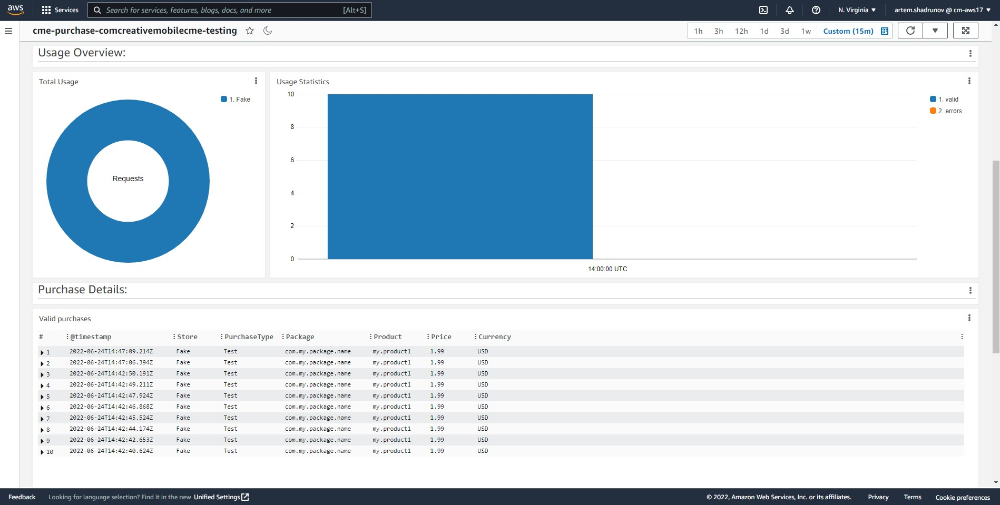

# Usage Statistics & Monitoring

Basic payment monitoring is available through AWS CloudWatch, and you can use CSV uploaded history to perform full-featured analysis with the tools of your choice.

##  Dashboard overview

To access the dashboard, press the 'Open Environment Dashboard' button. By default, the dashboard contains the following sections:

 * 'Purchase Overview'. Shows the amount of payments by day.
 * 'Usage Overview'. The graph shows the number of successful payments and those with an error.
 * 'Purchase Details'. Here you can read more about each specific payment.
 * 'Purchase Errors'. Details of payment errors.
 
 The dashboard controls are in the top right-hand corner. These can be used to:

* Change the reviewed period.
* Change the data update interval.
* Add widgets to dashboard, change its name, delete it, etc.

For more details on working with dashboards in CloudWatch, see the [official userguide](https://docs.aws.amazon.com/AmazonCloudWatch/latest/monitoring/CloudWatch_Dashboards.html).

##  Sensetive data 

Warning

The payment log includes the user's personal data, namely the <a href="/api_reference/CME.CloudPurchase/#F-CME-CloudPurchase-ValidationRequest-UserId">UserId</a> field. The default period for retaining personal data is two weeks.

##  Exporting to the '.csv'

With CloudWatch, you can export data from the widget to a '.csv' file. To do this, you need to:

1. Select a relevant widget. Press the 'View in CloudWatch Logs Insights' button.
2. Press the 'Run query' button.
3. Wait until the download is completed.
4. Select 'Download table (CSV)' from the 'Export results' menu.

