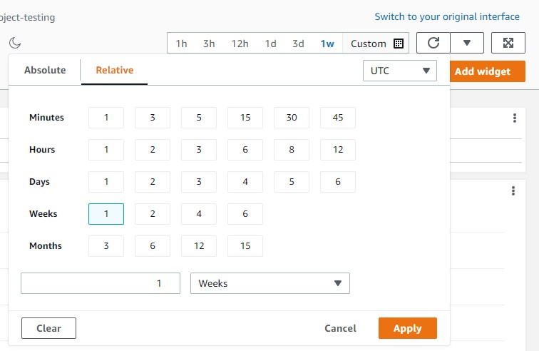
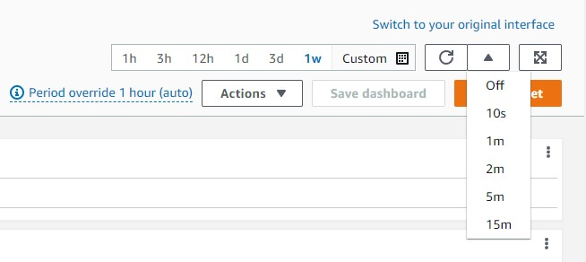
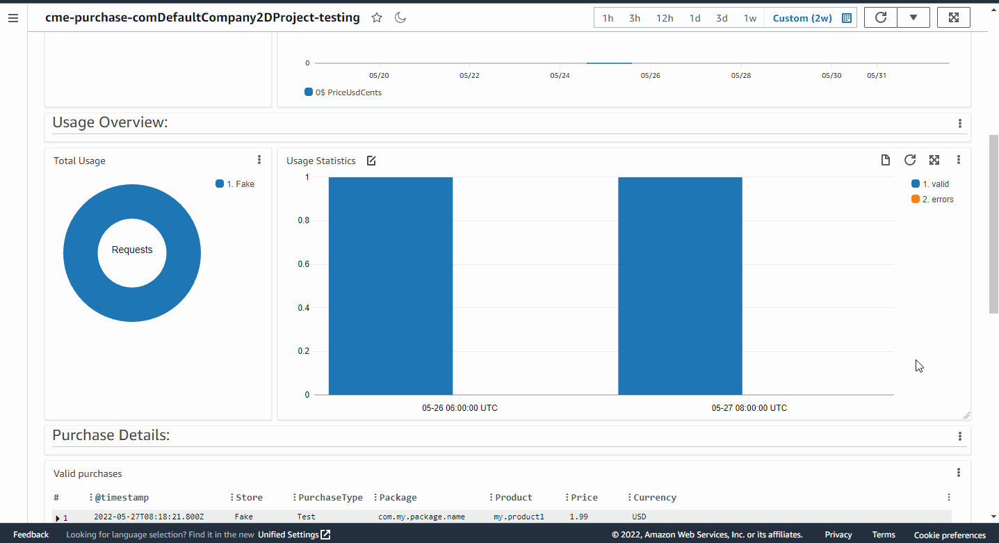

# Usage Statistics & Monitoring

Базовый мониторинг платежей доступен с использованием возможностей AWS CloudWatch, а с помощью выгруженной в CSV истории можно проводить полнофункциональный анализ удобными вам инструментами.

##  Sensetive data 

Здесь будет про персональные данные

##  Environment dashboard overview

Для того, чтобы перейти к дашборду, нужно нажать кнопку `Open Environment Dashboard`. По умолчанию дашборд содержит разделы:

 * `Purchases Overview`. Показывает сумму платежей по дням. 
 * `Usage Overview`. График отражает количество успешных платежей и платежей с ошибкой.
 * `Purchase Details`. Здесь можно подробнее изучить информацию о каждом конкретном платеже.
 * `Purchase Errors`. Детализация по ошибкам платежей.

 В правом верхнем углу находится элементы управления дашбордом. Здесь можно:

 * Изменить рассматриваемый период времени.

 * Изменить интервал обновления данных.
 

 * Добавить виджеты к дашборду, изменить имя дашборда, удалить дашборд и т.д.

Подробнее о работе с дашбордами в CloudWatch можно узнать [здесь](https://docs.aws.amazon.com/AmazonCloudWatch/latest/monitoring/CloudWatch_Dashboards.html).

##  Export your purchase history 

В CloudWatch существует возможность экспортировать данные из виджета в `.csv` файл. Для того, чтобы это сделать нужно:

1. Выбрать интересующий вас виджет. Нажать кнопку `View in CloudWatch Logs Insights`.
2. Нажать кнопку `Run query`.
3. Дождаться окончания загрузки.
4. В меню `Export results` выбрать пункт `Download table (CSV)`.

